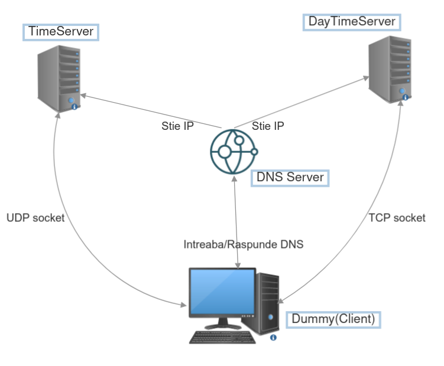

# Colocviu retele

1. dummy (client) 
    - Este bazat pe ubuntu:22.04
    - Contine utilitarele de retea si Oracle Java JDK 17
    - Are nameserver 172.16.0.1 adaugat in /etc/resolv.conf
    - Are IP-ul: 172.16.0.2
    - Depinde de pornirea dns-server, time-server si daytime-server si de completarea cu succes a time-client si daytime-client
2. dns-server
    - Este bazat pe maven:3-eclipse-temurin-17
    - Compileaza, impacheteaza si ruleaza aplicatia Java de DNS
    - Are IP-ul: 172.16.0.1
    - Mapeaza portul 53 catre host pe 5300
3. time-server
    - Este bazat pe maven:3-eclipse-temurin-17
    - Compileaza, impacheteaza si ruleaza serverul de time pe UDP
    - Are IP-ul: 172.16.0.3
    - Mapeaza portul local 7070 pe host 7070
4. time-client
    - Este bazat pe maven:3-eclipse-temurin-17
    - Compileaza si impacheteaza clientul de time
    - Copiaza pachetul JAR in volumul /app/compiled_jars mapat pe host in ./compiled_jars (relativ fata de docker-compose.yml)
    - Nu are entrypoint, pur si simplu compileaza si atat
5. daytime-server
    - Este bazat pe maven:3-eclipse-temurin-17
    - Compileaza, impacheteaza si ruleaza serverul de daytime pe TCP
    - Are IP-ul: 172.16.0.4
    - Mapeaza portul local 4040 pe host 4040
6. daytime-client
    - Este bazat pe maven:3-eclipse-temurin-17
    - Compileaza si impacheteaza clientul de time
    - Copiaza pachetul JAR in volumul /app/compiled_jars mapat pe host in ./compiled_jars (relativ fata de docker-compose.yml)
    - Nu are entrypoint, pur si simplu compileaza si atat
